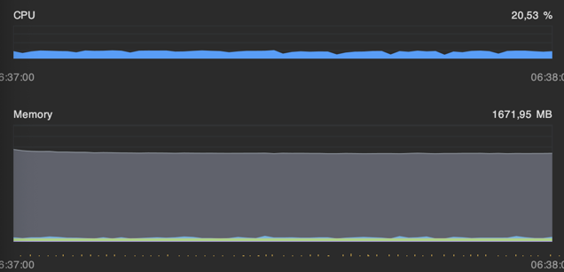
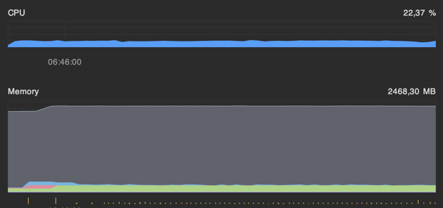
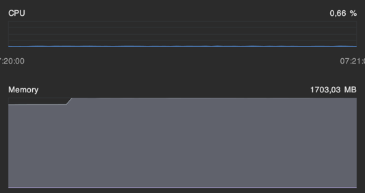

# О решении
Это библиотека для `ASP.NET`, которая предоставляет `Middleware` для стандартного конвейера HTTP запросов. Этот `Middleware` реализует один из подходов защиты от DoS атак - `Proof of Work`. Основная идея этого способа - решить `CPU bound` задачу при обращении к Api, тем самым валидируя, является ли запрос настоящим или частью спам атаки на веб ресурс.

## Как это работает
1. Сервер выдаёт клиенту задание — строку и уровень сложности (Difficulty).
2. Клиент подбирает такое число `Nonce`, чтобы `SHA256(Challenge + Nonce)` был меньше порога, зависящего от сложности.
3. Клиент отправляет `Challenge` и `Nonce` обратно. Сервер проверяет, что хэш действительно удовлетворяет условию и что задача ещё действительна (не истекла, не переиспользована).
4. Только после успешной проверки запроса клиент допускается к API.

### Почему был выбран именно PoW?
1. Нет зависимости от IP адреса источника. Подходит для работы с прокси, TOR, VPN и приватными API — не требует доверия к источнику запроса, устойчив к спуфингу.
2. Не требует участия пользователя, не мешает UX — подходит для API, CLI, ботов и скрытых систем.
3. Алгоритм на основе SHA256 простой и надежный.
4. Каждый запрос требует вычислений. Массовая атака требует массовые ресурсы, следовательно растёт цена атаки.

## Структура проекта

**/src**
Основное решение сосредоточено в двух проектах `DosProtection.AspNetLib.csproj` и `DosProtection.CoreLib.csproj`.
`DosProtection.CoreLib.csproj` содержит в себе общий класс, который реализует генерацию и валидацию PoW задач. Может быть использовать как в WebAPI, так и в клиенте .
`DosProtection.AspNetLib.csproj` представляет собой библиотеку для ASP.NET, которая предоставляет Middleware `PowChallengeMiddleware.cs` и инфраструктуру для его интеграции в ASP.NET приложения.
**/tests**
Здесь располагается тестовое окружения для стресс тестов и просто проект с Unit тестами.

# Тестирование

Для тестирования полученного Middleware, был создан тестовый стенд, который представляет собой два .NET проекта:
1. `TestEnvironment.Server.csproj`
   Это ASP.NET WebApi, которое использует `PowChallengeMiddleware` с проекта `DosProtection.AspNetLib.csproj` для автоматической выдачи PoW задач для каждого запроса к Api.
   API имеет всего один POST ендпоинт: `/test`, который в случае успеха возвращает приветственное сообщение.
2.  `TestEnvironment.Client.csproj`
    Это консольное приложение - стресс тест для API. В течении определенного времени оно шлет десятки тысяч запросов к серверу, параллельно решая PoW задачи. Таким образом мы имитируем DoS атаку.

### Тест кейс 1: Без решения челленджей, Без использования пула, 20 тысяч запросов в секунду

При таком конфиге, сервер упал в первые несколько секунд.
```json
"StressTestConfig":{  
  "Seconds": 1000,  
  "SolvePow": false,  
  "RequestsPerSecond": 100000,  
  "MaxParallelOperationsCount": 10000  
}
```

Причина была в том, что при каждом обращении к ручке, мы генерируем новую задачу, что весьма накладно по ресурсам на больших дистанциях. Решение нашлось в создании общего пула уже сгенерирванных, которые будут подменять друг друга при решении.

Был установлен такой конфиг - запоминаем 200 задач.
```json
"PowConfig":{
  "Difficulty": 16,
  "CacheLifetimeSeconds": 15,
  "PoolSize": 200
}
```

### Тест кейс 2: Без решения челленджей, С использованием пула, 20 тысяч запросов в секунду

```json
"StressTestConfig":{  
  "Seconds": 1000,  
  "SolvePow": false,  
  "RequestsPerSecond": 20000,  
  "MaxParallelOperationsCount": 10000  
}
```



### Тест кейс 3: Без решения челленджей, С использованием пула, 100 тысяч запросов в секунду

```json
"StressTestConfig":{  
  "Seconds": 1000,  
  "SolvePow": false,  
  "RequestsPerSecond": 100000,  
  "MaxParallelOperationsCount": 10000  
}
```


#### Тесты 2 и 3
Эти тесты показывают эффективность `ChallengePool`. Хранение заранее заготовленных задач лучше по производительности и стабильности, чем генерация челленджей при каждом обращении. 

Может показаться, что сильно растет потребление памяти. Но это быстро уходит после очередной сборки мусора.

### Тест кейс 4: С решением челленджей, < 100 запросов в секунду

В данном кейсе был включен просчет задач на хеширование со стороны клиента, из-за чего он стал не способен физически отправлять больше 100 запросов в секунду, так как ему требовалось время на выполнение задач. Потребление CPU на сервере значительно снизилось.

```json
"StressTestConfig":{
"Seconds": 1000,
  "SolvePow": true,
  "RequestsPerSecond": 1000,
  "MaxParallelOperationsCount": 10000
}
```



### Итоги по тестам

Защита работает, она дает возможность почти полностью предотвратить DoS атаки на **внутреннюю** инфраструктуру системы. Но есть и уязвимые места, например, точка входа, получение задания. Здесь идеально будет скомбинировать лучшее от всех подходов. Использовать rate limiting, proxy для контроля входящего трафика. 